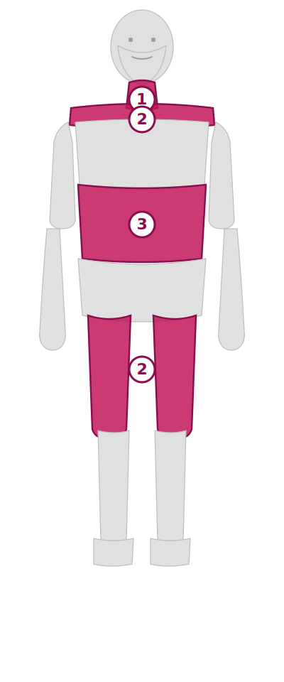

# Dear 美容整体 問診票（MVP版）

Next.js 15 で構築した来院前 Web 問診票の UI 検証版です。
顧客（店舗スタッフ）にインターフェースを試してもらうための最小構成。

## デモ版の仕様

- **DB保存なし**: 送信内容はサーバー側のログに出力されるだけ
- **認証なし**: 任意のURLで誰でも問診票を開ける
- **任意のトークン**: `/form/任意の文字列` でアクセス可能（例: `/form/demo`, `/form/test`）

→ UI / UX / 質問内容の確認用。後で Supabase 連携を追加して本番化予定。

## 機能

- 📱 スマホ最適化された 7 セクションの問診フォーム
- 🧍 クリッカブル人体図で部位を直感的に選択
- ✅ Zod による入力バリデーション
- 🎯 来院目的に応じてセクション6（体型・ダイエット）を自動スキップ

### 人体図のプレビュー



各部位をタップ → 関連するお悩みリストが下からせり出すボトムシート → 複数選択可能。
選択された部位はピンクで強調表示され、選択数がバッジで表示されます。

---

## デプロイ手順（Vercel）

### 1. GitHub にこのコードをアップロード

GitHub の Web UI から手動アップロード、または:

```bash
git init
git add .
git commit -m "MVP: 問診票UI"
git remote add origin <YOUR_REPO_URL>
git push -u origin main
```

### 2. Vercel にインポート

1. <https://vercel.com> にログイン
2. **Add New → Project** → GitHub リポジトリを選択
3. **Configure Project** はそのままで OK（環境変数の設定は不要）
4. **Deploy** クリック

1〜2分でビルドが完了し、`https://xxx.vercel.app` の URL が発行されます。

### 3. 顧客にURLを共有

- ランディング: `https://xxx.vercel.app`
- 問診票直リンク: `https://xxx.vercel.app/form/demo`

---

## 送信内容の確認方法

顧客が問診票を送信すると、内容は Vercel のログに記録されます。

1. Vercel Dashboard → 該当プロジェクト → **Logs** タブ
2. `[Counseling submission]` で検索
3. JSON 形式で送信内容が確認できます

---

## ローカルで動かす場合

```bash
npm install
npm run dev
# → http://localhost:3000
```

---

## ディレクトリ構成

```
dear-counseling/
├── app/
│   ├── form/[token]/
│   │   ├── page.tsx              # 問診票ページ
│   │   └── actions.ts            # Server Action（バリデーションのみ）
│   ├── thanks/page.tsx           # 送信完了ページ
│   ├── page.tsx                  # ランディング（デモボタン）
│   └── layout.tsx
├── components/
│   ├── form/
│   │   ├── CounselingForm.tsx    # メインフォーム
│   │   ├── ConcernsSelector.tsx  # 身体図⇄リスト切替
│   │   └── BodyDiagram.tsx       # ★ クリッカブル人体図
│   └── ui/                       # UIプリミティブ
├── lib/
│   ├── schema.ts                 # Zodスキーマ（58問の型定義）
│   ├── body-parts.ts             # 身体部位マッピング
│   └── utils.ts
├── supabase/migrations/          # 【本番化用】まだ使わない
└── docs/
    └── body-diagram-preview.png
```

---

## 本番化に向けて

UI/UX が確定したら、以下を追加します（別途実装予定）:

- [ ] Supabase 連携（DB保存、認証）
- [ ] スタッフ管理画面（回答一覧・詳細）
- [ ] トークン式の招待URL発行
- [ ] AI 事前サマリー生成（Claude API）
- [ ] LINE 通知 / 送信完了メール

`supabase/migrations/` に本番用のスキーマSQLは既に用意済み。

---

## 技術スタック

- Next.js 15 (App Router)
- TypeScript / Tailwind CSS
- React Hook Form + Zod
- Radix UI

---

© 株式会社 vie
